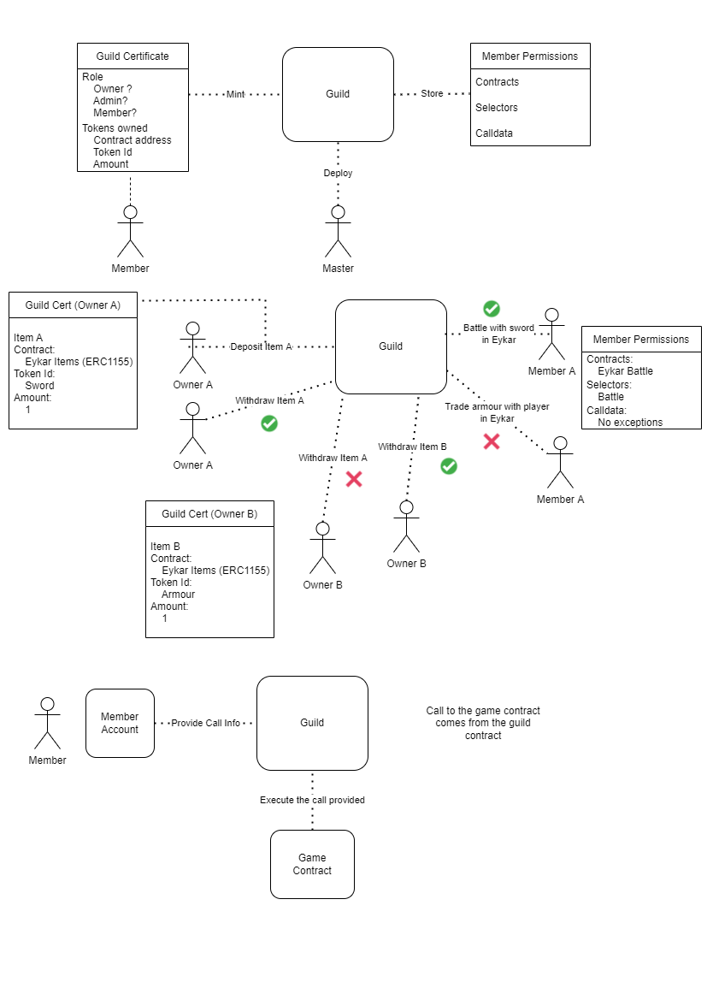

# Game Guilds
An implementation for having guilds within games on Starknet.

_Disclaimer: This code is not intended for production use and has not been audited or tested thoroughly. This is just an initial experiment_

## Description
The purpose of this project is to create a multi owner guild where players can share the game assets between eachother. The guild is token gated and players can distribute NFTs to spread access.

This project provides the following:

  - Account that has multiple owners based on NFT gated access.

## Architecture



## Setup

```
python3.7 -m venv venv
source venv/bin/activate
python -m pip install cairo-nile
nile install
```

## Acknowledgements

[udayj](https://twitter.com/udayj) for their implementation of a [token gated account](https://github.com/udayj/token_gated_account)